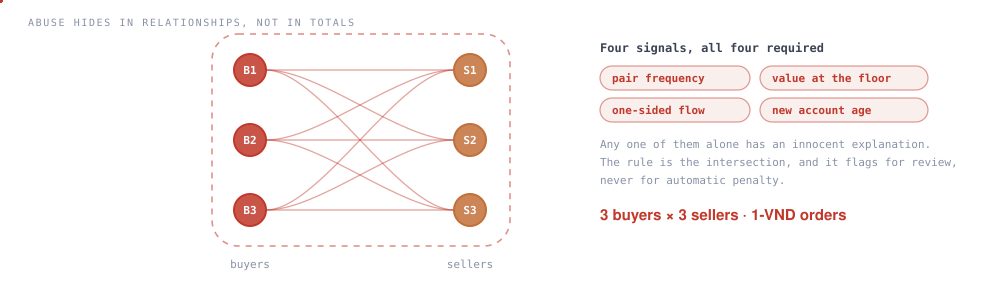

# Voucher Abuse Ring Detection


[](https://github.com/nhmTri/voucher-abuse-detection/actions/workflows/sql-tests.yml)




Pair-level network analysis on marketplace campaign transactions. Promotion budget was leaking, and totals looked normal — because **abuse hides in relationships, not in totals**.

**Found: a closed ring of 3 buyers and 3 sellers trading 1-VND orders**, created only to claim vouchers.

---

## Why totals missed it

Campaign-level spend, redemption rate and average order value all sat inside normal range. The ring only appears when you stop aggregating by campaign and start aggregating by **buyer–seller pair**: the same six accounts transacting with each other, at the price floor, in one direction, on accounts opened days before the campaign.

## The four signals

| Signal | What it measures | Why it matters alone is not enough |
|---|---|---|
| **Pair frequency** | Repeat transactions between the same buyer and seller | Loyal customers also repeat |
| **Value at the floor** | Order value at or near the minimum qualifying amount | Cheap products are also cheap |
| **One-sided flow** | Value moves one way and never back | Normal retail is one-sided too |
| **Account age at first redemption** | Days between account creation and first voucher claim | New users are not automatically fraudulent |

**No single signal is a rule.** Each one alone produces false positives on legitimate behaviour. The rule is the intersection — and the write-up argues the false-positive case explicitly, because a control team has to live with what it fires on.

## Output

Delivered as a rule specification a control team can run on live data, not as a one-off chart:

```
flag_pair  = pair_txn_count      >= :min_pair_txns
         AND pct_orders_at_floor >= :floor_threshold
         AND flow_ratio          >= :one_sided_threshold
         AND account_age_days    <= :new_account_window
```

Every threshold is a parameter. `rules/pair_frequency.sql` is the detection query; thresholds are set per campaign, not baked in.

## Run it

```bash
make run     # load the synthetic ring plus legitimate repeat buyers, run the rule
make test    # assert it flags all 9 ring pairs and none of the legitimate ones
```

CI runs that assertion against PostgreSQL 16 on every push. **The test that matters is the second one** — a rule that catches fraud is easy, a rule that catches fraud without touching real customers is the job.

Full parameter table and escalation policy: [`docs/rule-spec.md`](docs/rule-spec.md). Data provenance: [`data/README.md`](data/README.md).

## Repo map

```
rules/            detection SQL
tests/            the assertion CI runs on every push
docs/rule-spec.md parameters, escalation policy and known limits
data/sample/      synthetic transactions - no client data
```

---

**Stack** · Power BI · Excel · transaction-level rule design · SQL
**More** · [portfolio case study](https://portfolionhmtri.netlify.app)
